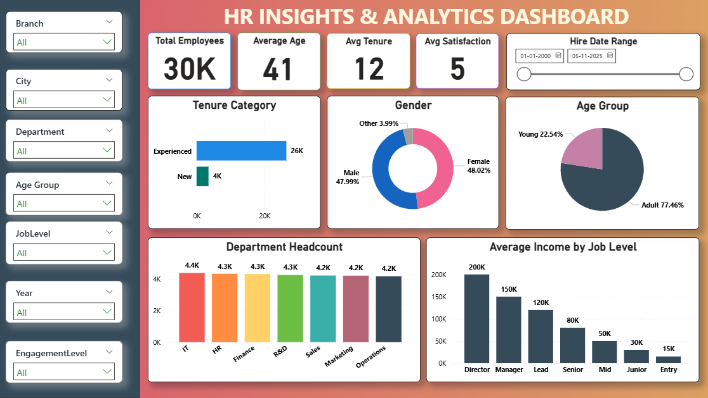
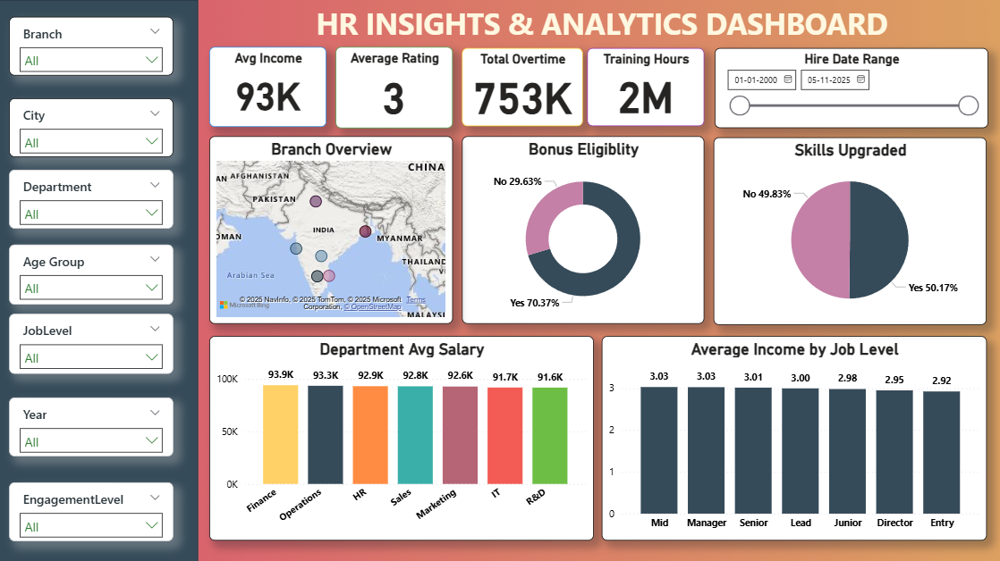
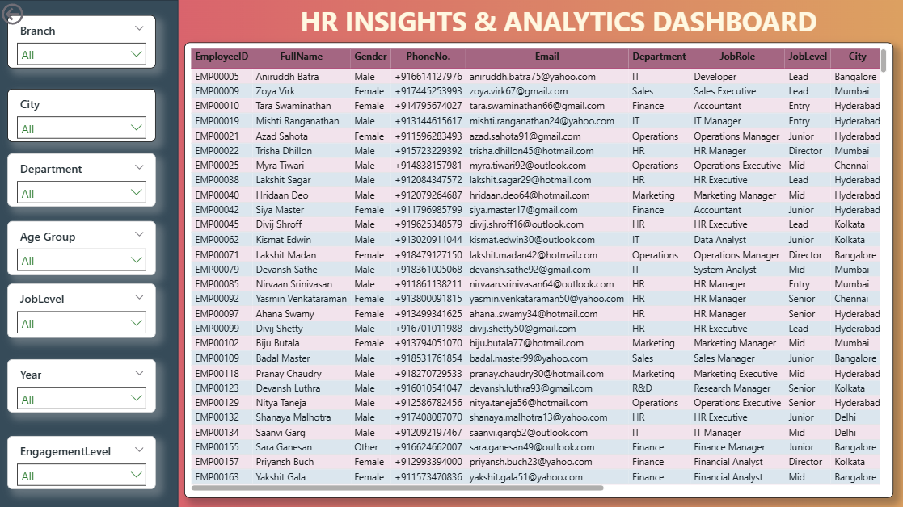

# HR Analytics Dashboard

This Power BI dashboard provides data-driven insights into workforce demographics, performance, and engagement — enabling HR teams to make informed decisions about talent management and employee satisfaction.

---

## 🧾 Objective
To analyze key HR metrics such as employee turnover, engagement level, satisfaction, tenure, and compensation trends across departments and job levels.

---

## 📊 Key Insights
- The organization employs over **30,000 employees**, with an **average age of 41** and **average tenure of 12 years** — showing a mature, experienced workforce.  
- **Experienced employees (26K)** dominate the workforce, while **new hires (4K)** form a smaller segment.  
- Gender distribution is balanced — **48% female**, **48% male**, and **4% other**.  
- Majority of employees (77%) fall in the **adult (25–40 years)** category, with only 22% being younger employees.  
- **IT, HR, and Finance** departments have the highest headcount, maintaining near-equal distribution across functions.  
- **Average income** increases consistently by job level — from ₹15K at entry level to ₹200K at director level.  
- Across branches, the **average salary is ₹93K**, with **Finance and Operations** being top-paying departments.  
- **70% of employees are bonus-eligible**, and **50% have upgraded their skills** through training programs.  
- The total **overtime hours (753K)** and **training hours (2M)** reflect a highly active and engaged workforce.  
- Employee records provide detailed HR information including department, job level, city, and engagement metrics for granular analysis.

---

## 📸 Dashboard Previews

---

## 📁 Included Files
- **HR Analytics Overview.pdf** – Project summary document  
- **HR Analytics Dataset.xlsx** – Employee and performance dataset used for analysis  

---

### 🧠 Tools & Skills Used
- Power BI Desktop  
- Power Query for data transformation  
- DAX measures for KPIs and calculations  
- Data modeling and relationship building  
- HR data visualization and storytelling  

---
